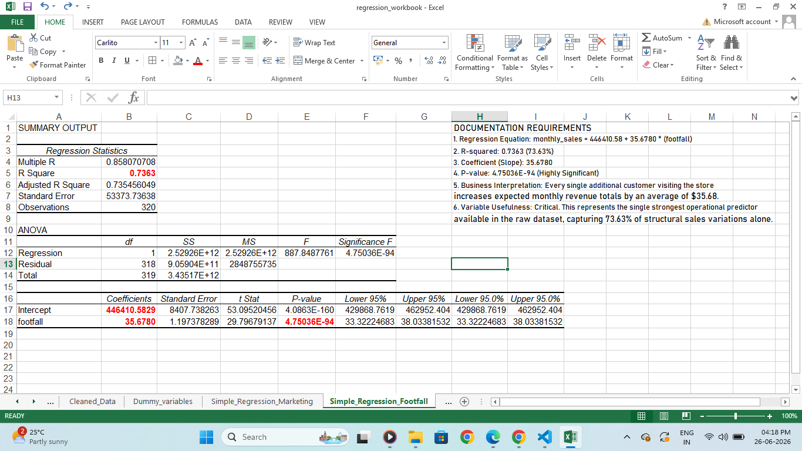
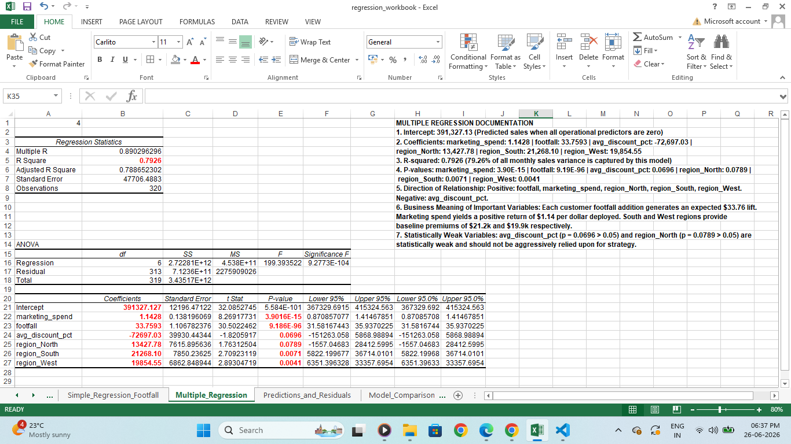
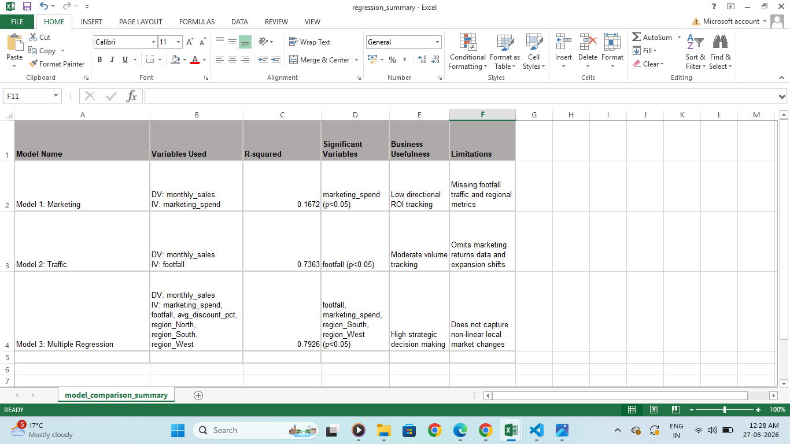
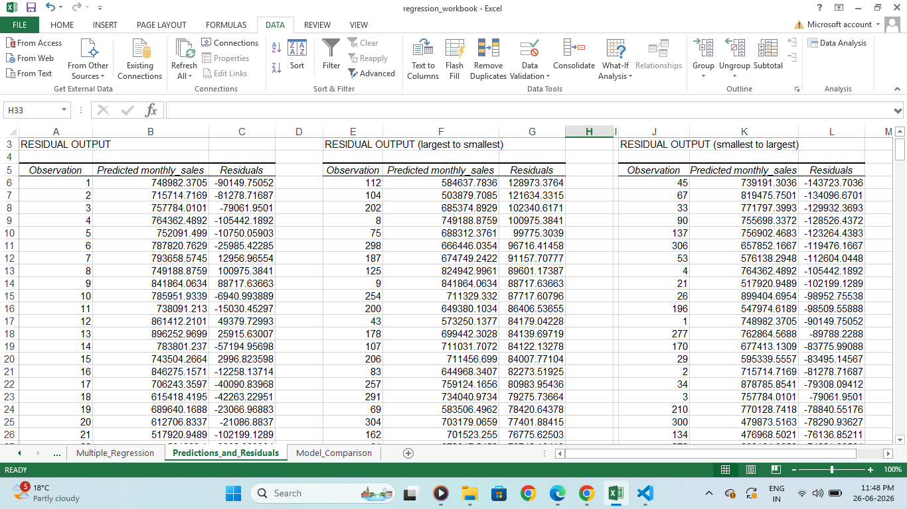

# Retail Store Performance - Regression Analysis & Insights

This repository contains a data-driven operational analysis built to identify, isolate, and forecast the foundational drivers of monthly store sales across our retail footprint.

## 1. Business Problem Summary

The executive leadership team of a major retail chain wants to understand what underlying operational factors drive monthly store sales performance. The goal is to optimize monthly marketing budget allocations, handle store inventory effectively, refine regional discount structures, and direct staffing profiles. This project applies linear regression modeling to isolate significant operational drivers and guide strategic capital expenditure decisions.

## 2. Dataset Description

The underlying analytical dataset captures 320 historical, structural monthly store performance profiles across diverse geographical branches. It contains continuous operational, environmental, customer-centric indicators, and categorical classifications.

## 3. Variable Blueprint

* **Dependent Variable ($Y$):** `monthly_sales` (Continuous financial performance target)
* **Numerical Independent Variables ($X$):** `marketing_spend`, `footfall`, `avg_discount_pct`, `staff_count`, `inventory_availability_pct`, `competitor_distance_km`, `customer_rating`
* **Categorical Independent Variables ($X$):** `region`, `store_type`
* **Exempt Variables:** `store_id` (Non-predictive tracking identifier), `monthly_profit` (Omitted to protect matrices against collinear redundancy metrics).

## 4. Regression Approach

The data modeling pipeline executed across two core progressive milestones:
1. **Simple Linear Regression:** Run independently across our two strongest operational indicators (`marketing_spend` and `footfall`) to evaluate isolated impact trajectories and direct returns on investment.
2. **Multiple Linear Regression:** Run combining multiple numerical predictors alongside engineered binary dummies simultaneously. This minimizes baseline error rates, controls for cross-variable interactions, and optimizes explanatory power.

## 5. Dummy Variable Approach

To evaluate qualitative attributes mathematically within the linear matrices, categorical fields were converted into numeric binary parameters ($1$ or $0$). To eliminate absolute collinearity (the dummy variable trap), an omitted reference category was established for each block:

* **Regional Dummy Blocks:** `region_North`, `region_South`, `region_West` (Omitted Reference Baseline Category: **`East`**)
* **Store Format Dummy Blocks:** `store_High_Street`, `store_Airport`, `store_Mall` (Omitted Reference Baseline Category: **`Residential`**)

## 6. Model Comparison Summary

The strategic performance indicators across all tested mathematical variations track as follows:

| Model Version | Variables Included | R-Squared | Significant Predictors ($p < 0.05$) | Operational Utility |
| :--- | :--- | :--- | :--- | :--- |
| **Model 1: Marketing** | `marketing_spend` | 0.1672 (16.72%) | `marketing_spend` | Low; tracks direction but omits traffic drivers. |
| **Model 2: Traffic** | `footfall` | 0.7363 (73.63%) | `footfall` | Moderate; proves customer volume is a baseline driver. |
| **Model 3: Multiple** | 3 Numerical + Region Dummies | 0.7926 (79.26%) | `footfall`, `marketing_spend`, `region_South`, `region_West` | High holistic forecasting and budget allocation tool. |

## 7. Final Model Selected & Equations

The **Multiple Linear Regression Model** was selected as the definitive corporate forecasting tool because it expands the model's explanatory power (**R-Squared**) to **79.26%** and dramatically minimizes the baseline standard error down to 47,706.49.

### Mathematical Equations:
* **Simple Model 1:** $\text{monthly\_sales} = 560,777.35 + 2.1296 \times (\text{marketing\_spend})$
* **Simple Model 2:** $\text{monthly\_sales} = 446,410.58 + 35.6780 \times (\text{footfall})$
* **Selected Final Model:**
  $$\text{monthly\_sales} = 391,327.13 + 1.1428(\text{marketing\_spend}) + 33.7593(\text{footfall}) - 72,697.03(\text{avg\_discount\_pct}) + 13,427.78(\text{region\_North}) + 21,268.10(\text{region\_South}) + 19,854.55(\text{region\_West})$$

## 8. Business Recommendation

* **Prioritize Traffic Channels:** Customer footfall represents the single strongest growth catalyst. Each additional visitor yields an expected average revenue lift of **$33.76**. Direct capital to prime real estate acquisitions (Malls/Airports) to build a high traffic baseline.
* **Geographic Focus Shift:** Allocate expansion budgets to the **South** and **West** sectors, which generate structural premiums of **$21,268** and **$19,854** respectively over the East division.
* **Re-evaluate Price Promotions:** Aggressive discount slashing displays a negative slope and weak statistical significance ($p = 0.0696 > 0.05$), diluting profit margins without expanding sales volume.

## 9. Assumptions & Limitations

* **Association vs. Causation Fallacy:** This analysis demonstrates statistical association, not direct physical causation. High footfall correlation does not automatically mean footfall caused the sale (e.g., product availability or seasonality could be driving both traffic and purchases simultaneously).
* **Omitted Variable Risk:** The final model captures 79.26% of data variances. The remaining 20.74% is an unmapped limitation driven by external inputs not provided in our data tables—such as local manager performance profiles, sudden competitor store entries, or supply chain stockouts.

## 10. Captured Repository Screenshots

To review the structural architecture and validation logs of this project, clear image previews are rendered below:

### Simple Regression Optimization Output (Model 1)

### Holistic Multiple Regression Summary Card

### Model Evaluation & Comparison Workspace

### Sorted Model Residual Error Trends
